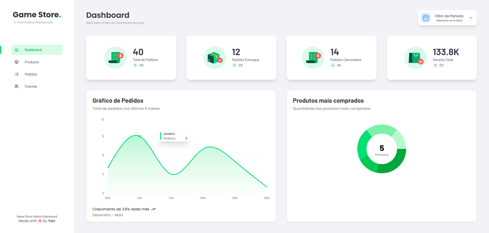

# **Game Store Dashboard**



## 📋 Descrição

Dashboard de administração para um e-commerce de games. Desenvolvido com Next.js (App Router), oferece uma interface moderna para visualização de produtos, usuários, pedidos e análise de gráficos.

## 🚀 Tecnologias Principais

- **Framework**: Next.js 15 (App Router)
- **Linguagem**: TypeScript
- **Estilização**: Tailwind CSS
- **Gráficos**: Shadcn e Recharts
- **Ícones**: Lucide
- **Requisições HTTP**: Axios

## ✨ Funcionalidades

- Gerenciamento de usuários e pedidos
- Dashboard analítico com gráficos interativos
- Visualização de métricas em tempo real
- Tabelas paginadas e filtros avançados
- Interface responsiva e acessível
- Roteamento avançado com Next.js App Router

## Como Executar o Projeto

1. Acesse o link do deploy da aplicação

[Game Store Dashboard](https://games-store-dashboard.vercel.app)

2. Rode o projeto localmente

## Pré-requisitos

Node.js 18 ou superior

npm, yarn ou pnpm

Instalação
Clone o repositório do FrontEnd:

```bash
git clone https://github.com/Yan-CarlosIF/games-store-dashboard.git
```

Clone o repositório do BackEnd: [Game Store API](https://github.com/Yan-CarlosIF/game-store-dashboard-api)

# Acesse a pasta do projeto:

```bash
cd games-store-dashboard
```

Instale as dependências:

```bash
pnpm install
```

## Execução:

Modo desenvolvimento:

```bash
pnpm run dev
```

Modo produção:

```bash
pnpm run build

# após a build, rode o servidor de produção

pnpm run start
```

O aplicativo estará disponível em http://localhost:3000
